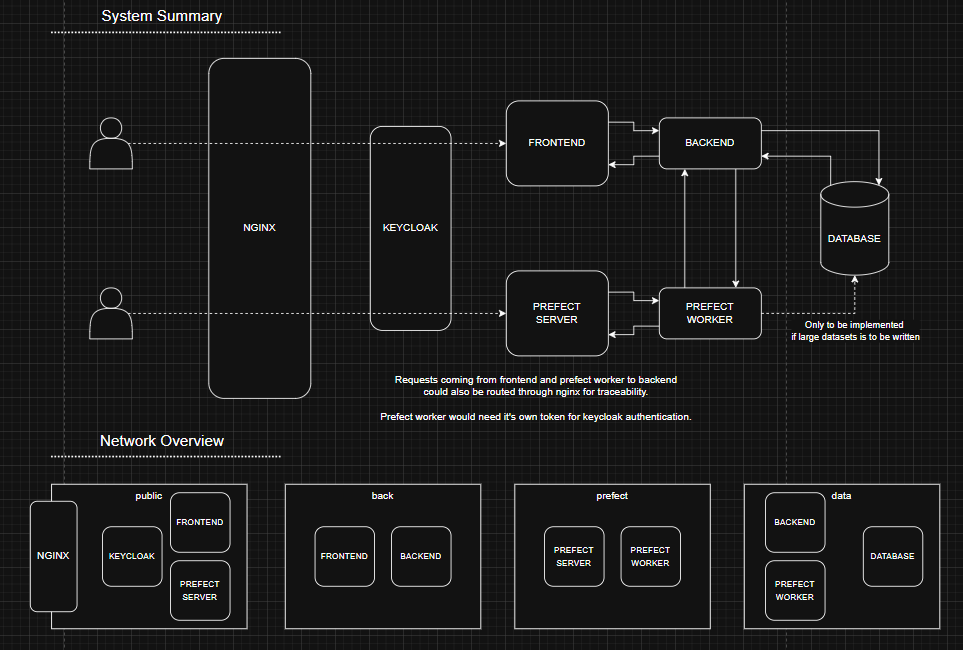

# data-platform


Designing and testing a data platform.  
Proof of concept, not fully implemented.

In a completed version, prefect would have flows for data analysis and the frontend would show the processed data in charts.
Right now only a file name and path is shown in the frontend for each prefect flow run.

## Usage
To get everything running:

```bash
docker compose up -d --build
```

Then everything should be reachable from:

```
localhost -> Default index
localhost/prefect -> Prefect frontend
localhost/frontend -> File names
```

Go to http://localhost/prefect/deployments, quick run the register_file deployment.  
Watch the flow run, then you can see the file name in the frontend.
